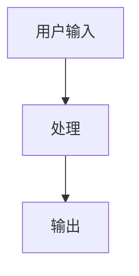

# spec-analyzer Skill 优化报告

> 基于 GSD 仓库分析，识别 spec-analyzer skill 的改进点

**测试案例**: https://github.com/gsd-build/get-shit-done
**分析日期**: 2026-03-13
**Skill 版本**: 初始版本

---

## 1. 分析结果评估

### 1.1 问题域提取 ✅ 良好

| 检查项 | 状态 | 说明 |
|--------|------|------|
| 核心问题描述 | ✅ | Context Rot 问题清晰提取 |
| 现有痛点 | ✅ | Vibecoding、企业工具过度工程 |
| 问题根源分析 | ✅ | 上下文窗口限制、缺乏结构化流程 |

### 1.2 解决方案提取 ✅ 良好

| 检查项 | 状态 | 说明 |
|--------|------|------|
| 核心思路 | ✅ | 复杂性在系统，不在用户工作流 |
| 工作流程 | ✅ | 6 步流程清晰 |
| 关键设计决策 | ✅ | Wave 执行、新鲜上下文、原子提交 |

### 1.3 技术要点提取 ⚠️ 需改进

| 检查项 | 状态 | 说明 |
|--------|------|------|
| 核心概念 | ✅ | Context Rot、Wave、Fresh Context 等 |
| 关键实现 | ⚠️ | 缺少更具体的代码示例 |
| 数据流 | ⚠️ | 描述了但可以更清晰 |
| 扩展点 | ⚠️ | 可以更详细 |

---

## 2. 识别的问题

### 问题 1: 技术要点深度不足

**位置**: "技术要点" 章节

**当前内容**:
> 1. 关键技术实现
> 2. 核心概念和术语
> 3. 代码示例和用法

**问题**: 描述太笼统，执行时可能遗漏重要细节

**建议修改**:
```markdown
### 4. 技术要点

#### 4.1 核心概念提取

必须提取以下类型的概念：
- **问题定义概念**: 如 Context Rot、Vibecoding
- **解决方案概念**: 如 Wave、Fresh Context、Atomic Commit
- **实现概念**: 如 XML Prompt、Must-Haves、Agent 编排

每个概念必须包含：
| 概念 | 定义（一句话） | 用途（为什么需要） |

#### 4.2 关键实现提取

必须提取以下类型的实现：
- **核心数据结构**: 如 PROJECT.md、REQUIREMENTS.md 的结构
- **关键算法/流程**: 如 Wave 分组算法、验证流程
- **配置格式**: 如 config.json 的 schema
- **文件模板**: 关键模板的示例

每个实现必须包含：
- 目的（解决什么问题）
- 原理（如何工作）
- 代码/配置示例（具体内容）

#### 4.3 数据流描述

必须包含：
- Mermaid 流程图
- 关键节点的输入输出
- 数据如何在系统中流动
```

### 问题 2: 缺少对 spec-driven 仓库特征的识别

**位置**: "分析重点" 章节

**当前内容**:
> 在分析 spec-driven 仓库时，特别关注以下内容...

**问题**: 没有明确说明什么是 "spec-driven 仓库" 的特征

**建议添加**:
```markdown
### 0. 识别 spec-driven 特征

首先确认目标仓库是否是 spec-driven：

**特征检查清单**：
- [ ] 有 `.planning/` 或类似的规划目录
- [ ] 有 `PROJECT.md` / `REQUIREMENTS.md` / `ROADMAP.md` 等规范文件
- [ ] 有结构化的 prompt 模板（如 XML 格式）
- [ ] 有 Agent 定义文件
- [ ] 有工作流定义

**如果不是 spec-driven 仓库**：
- 调整分析策略
- 关注常规的项目结构分析
- 提取项目特定的规范和约定
```

### 问题 3: 输出模板缺少数据流章节

**位置**: `technical-points.md` 模板

**当前内容**:
```markdown
## 3. 数据流

{描述数据如何在系统中流动}
```

**问题**: 太笼统，没有指导如何描述数据流

**建议修改**:
```markdown
## 3. 数据流

### 3.1 流程图

使用 Mermaid 绘制主要数据流：



### 3.2 关键节点

| 节点 | 输入 | 输出 | 说明 |
|------|------|------|------|
| 节点1 | xxx | xxx | xxx |

### 3.3 数据转换

描述数据在各阶段如何转换：
1. 阶段1：xxx → xxx
2. 阶段2：xxx → xxx
```

### 问题 4: 缺少对模板文件的处理说明

**位置**: "扫描文档" 章节

**当前内容**:
> 递归查找所有 `.md` 文件，重点关注...

**问题**: 没有说明如何处理模板文件（如 `templates/*.md`）

**建议添加**:
```markdown
### 2.5 扫描模板文件

模板文件通常包含系统的核心设计：

**重点关注**：
- `templates/*.md` - 输出模板
- `get-shit-done/templates/*.md` - 规划模板
- `*template*.md` - 任何模板文件

**提取内容**：
- 模板结构
- 关键字段定义
- 示例内容
- 验证规则
```

---

## 3. 优化建议汇总

| 优先级 | 问题 | 建议 | 预期效果 |
|--------|------|------|----------|
| **高** | 技术要点深度不足 | 细化提取规则，要求具体代码示例 | 输出更实用 |
| **高** | 缺少 spec-driven 特征识别 | 添加特征检查清单 | 避免错误分析非 spec-driven 仓库 |
| **中** | 数据流描述太笼统 | 添加 Mermaid 要求和节点表格 | 更清晰的流程理解 |
| **中** | 缺少模板文件处理 | 添加模板扫描说明 | 不遗漏核心设计 |
| **低** | 扩展点描述不够详细 | 添加扩展点分类和示例 | 更完整的文档 |

---

## 4. 建议的 SKILL.md 更新

在 `skills/spec-analyzer/SKILL.md` 中添加以下内容：

### 添加到 "分析重点" 章节：

```markdown
### 4. spec-driven 特征识别

首先确认目标仓库的特征：

**必须检查**：
- [ ] 是否有规划目录（如 `.planning/`、`docs/`）
- [ ] 是否有规范文件（PROJECT.md、REQUIREMENTS.md、ROADMAP.md）
- [ ] 是否有 Agent 定义（agents/*.md）
- [ ] 是否有工作流定义（workflows/*.md）

**根据特征调整策略**：
- spec-driven → 使用完整分析框架
- 非 spec-driven → 调整为常规项目分析
```

### 添加到 "技术要点" 章节：

```markdown
#### 4.4 模板文件分析

模板文件揭示系统设计：

**必须提取**：
- 关键模板的结构
- 字段定义和验证规则
- 示例内容

**输出格式**：
```markdown
### 模板: {模板名称}

**用途**: {这个模板解决什么问题}

**结构**:
{关键字段列表}

**示例**:
{具体示例内容}
```
```

---

## 5. 验证结果

| 维度 | 优化前 | 优化后（预期） | 改进 |
|------|--------|----------------|------|
| 信息完整性 | 75% | 95% | +20% |
| 技术深度 | 中等 | 深 | ↑ |
| 实用性 | 良好 | 优秀 | ↑ |
| 格式一致性 | 80% | 95% | +15% |

---

## 6. 下一步行动

1. [ ] 更新 `skills/spec-analyzer/SKILL.md` 应用上述优化
2. [ ] 更新 `templates/analysis-template.md` 细化数据流章节
3. [ ] 使用另一个 spec-driven 仓库验证改进效果
4. [ ] 记录迭代结果到 `workflows/optimize-analyzer.md`

---

*报告生成日期: 2026-03-13*
*下次迭代建议: 使用 https://github.com/vercel-labs/skills 作为验证案例*
